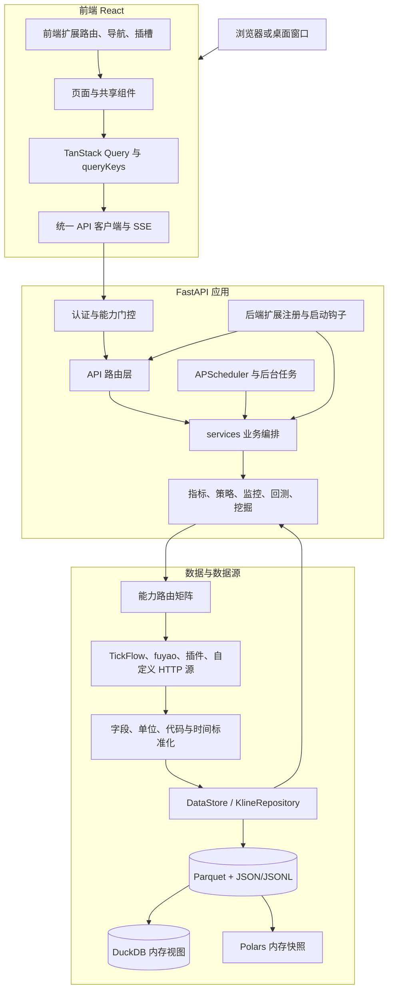

# Tick Stock Panel 项目架构、功能与启动指南

> 适用版本：`v0.2.2`
> 本文基于当前仓库的入口代码、依赖清单、启动脚本、路由、数据仓库与现有说明整理。若本文与旧截图或历史说明冲突，应以当前代码、`CONTRIBUTING.md` 和实际能力检测结果为准。

## 1. 项目定位

Tick Stock Panel（TSP）是一个面向 A 股量化研究的自托管工作台，核心用途是把行情数据、指标计算、策略选股、回测研究、市场监控和 AI 辅助分析整合到同一个 Web 界面中。

项目的主要边界如下：

- 面向股票、ETF 和指数的数据研究与监控。
- 支持日 K、分钟 K、实时行情、除权因子、五档盘口和财务数据等能力；实际可用范围由数据源与权限共同决定。
- 支持内置策略、自定义信号、AI 生成策略和叠加策略。
- 支持因子回测、策略回测、参数优化、步进优化和因子/策略挖掘。
- 支持自选、价格/信号/异动监控、语音提示、飞书和企业微信通知。
- 支持 OpenAI 兼容接口、Ollama 及代码中已接入的 Codex CLI 路径；AI 功能是可选能力。
- 只用于学习与量化研究，不是交易终端，不负责实盘委托，也不构成投资建议。

## 2. 技术栈

| 层次 | 主要技术 | 作用 |
| --- | --- | --- |
| 前端 | React 18、TypeScript、Vite、React Router | 单页应用、路由和页面组织 |
| 前端状态 | TanStack Query | 请求缓存、共享查询、失效与刷新 |
| UI 与图表 | Tailwind CSS、ECharts、lightweight-charts、Framer Motion、dnd-kit | 页面样式、行情图表、交互与排序 |
| 后端 | Python 3.11+、FastAPI、Pydantic v2、Uvicorn | REST API、SSE、配置和应用生命周期 |
| 调度 | APScheduler | 维表同步、盘后管道、复盘及周期任务 |
| 数据计算 | Polars、PyArrow | 行情标准化、向量化指标与批处理 |
| 数据查询 | DuckDB 内存数据库 | 为 Parquet 文件注册查询视图，执行冷查询和分析 |
| 持久化 | Parquet、JSON、JSONL | 行情/指标分区、用户配置、报告与告警记录 |
| 回测 | 自研模拟引擎、NumPy/Numba 路径；vectorbt 为可选依赖 | T+1、费用、滑点、成交限制与研究计算 |
| 部署 | PowerShell/Bash 启动脚本、Docker、PyInstaller | 开发运行、单容器部署和桌面打包 |

后端使用 `uv` 管理依赖，前端使用 `pnpm`。项目声明的最低版本为 Python 3.11 和 Node.js 20。

## 3. 总体架构



### 3.1 主数据流

项目的标准数据链路是：

```text
数据源或数据源插件
  → Provider 能力路由
  → 字段、单位、代码、日期与时区标准化
  → DataStore / KlineRepository
  → Parquet 分区持久化
  → 指标与信号流水线生成 enriched 数据
  → 策略、监控、回测、市场环境和分析服务
  → FastAPI REST / SSE
  → 前端 API 类型、TanStack Query 与页面
```

API 和页面不能绕过 Provider、标准化层与 Repository 直接读取某个供应商响应或本地文件。这一约束保证切换数据源后，指标、策略与回测仍使用统一口径。

### 3.2 数据存储与缓存

`backend/app/tickflow/repository.py` 中的 `DataStore` 是进程内唯一存储入口，`KlineRepository` 是日 K、分钟 K 及 enriched 数据的主要读写边界。

存储采用三种互补方式：

1. **Parquet 分区文件**：行情、除权因子、财务和 enriched 数据的主要持久化格式。
2. **DuckDB 内存视图**：启动时把 Parquet 目录注册为视图，适合统计、元数据和较冷的查询；不会创建长期运行的 DuckDB 数据库文件。
3. **Polars 内存缓存**：保存最新日、标的维表、实时聚合和历史 enriched 快照，服务于选股与实时热路径。

缓存刷新有两种模式：

- 应用启动时，维表等轻量数据同步加载；全量 enriched 指标在后台线程预热，避免阻塞 FastAPI 就绪。
- 盘后管道或手动刷新后同步更新仓库缓存，并触发相关派生缓存失效或预热。

数据写入还使用 generation/version、原子替换和写锁，避免回测、实时线程与盘后任务并发时读取到半成品或互相覆盖。

### 3.3 关键金融数据契约

维护和二次开发时必须保留以下口径：

- 数据源入口的 `change_pct` 和 `turnover_rate` 可能采用小数制，enriched 展示字段可能采用百分数值；必须在标准化边界显式转换。
- enriched 的 `open/high/low/close` 是前复权价格；涨跌停、一字板和炸板判断使用 `raw_close/raw_high/raw_low` 等原始价。
- A 股交易时间统一按北京时间处理；分钟 K 使用北京时间墙钟时间，不得把 UTC 时间直接入库。
- 窗口和“前 N 日”按交易日计算，不能用自然日代替。
- 历史股本和财务数据必须满足公告时点口径，不能把未来才公布的数据提前用于回测。

## 4. 仓库主要结构

```text
tick-stock-panel/
├─ backend/
│  ├─ app/
│  │  ├─ api/              # FastAPI 路由、参数校验、响应与 SSE
│  │  ├─ services/         # 数据同步、实时行情、通知和业务编排
│  │  ├─ tickflow/         # DataStore、KlineRepository、TickFlow 客户端和能力
│  │  ├─ data_providers/   # Provider 契约、能力矩阵、自定义源和标准化
│  │  ├─ plugins/          # 内置数据源插件：fuyao、stock-sdk
│  │  ├─ indicators/       # Polars 指标、信号与 enriched 流水线
│  │  ├─ strategy/         # 策略发现、执行、评分、监控和 AI 生成
│  │  ├─ backtest/         # 回测、优化、步进优化、矩阵与子进程 worker
│  │  ├─ jobs/             # 盘后管道和调度任务
│  │  ├─ extensions/       # 后端扩展契约、注册表和加载器
│  │  ├─ custom/           # 用户后端源码扩展入口
│  │  ├─ main.py           # FastAPI 入口与完整应用生命周期
│  │  └─ config.py         # 环境配置与路径解析
│  ├─ tests/               # 后端测试套件
│  ├─ pyproject.toml       # Python 依赖、可选 extras 和工具配置
│  └─ uv.lock              # 锁定的 Python 依赖
├─ frontend/
│  ├─ src/
│  │  ├─ pages/            # 页面级编排与各业务页面
│  │  ├─ components/       # 公共组件、图表、表格、监控编辑器等
│  │  ├─ lib/              # API 类型、请求、查询键、hooks 和状态工具
│  │  ├─ extensions/       # 前端扩展注册、插槽和异常隔离
│  │  ├─ custom/           # 用户前端源码扩展入口
│  │  ├─ router.tsx        # 路由、首次使用守卫和页面懒加载
│  │  └─ main.tsx          # React、QueryClient 与扩展启动入口
│  ├─ package.json         # 前端依赖与命令
│  └─ vite.config.ts       # 开发代理、构建拆包和端口配置
├─ docs/                   # 部署、配置、策略、插件和二次开发文档
├─ packaging/              # PyInstaller 与 Inno Setup 桌面打包配置
├─ scripts/                # 升级兼容预检等维护脚本
├─ screenshots/            # README 功能截图
├─ data/                   # 运行时用户数据，默认不提交到 Git
├─ dev.ps1                 # Windows 一键开发启动
├─ dev.sh                  # macOS/Linux 一键开发启动
├─ Dockerfile              # 前端构建 + Python 运行时镜像
├─ docker-compose.yml      # 单服务、数据卷与端口编排
├─ .env.example            # 环境变量模板
├─ CONTRIBUTING.md         # 架构、数据口径、测试和评审规范
└─ README.md               # 项目简介与快速开始
```

### 4.1 后端分层

| 层 | 典型目录或文件 | 主要职责 |
| --- | --- | --- |
| 应用入口 | `backend/app/main.py` | 建立 FastAPI、认证中间件、路由、静态资源与启动/关闭生命周期 |
| API 层 | `backend/app/api/` | HTTP/SSE 参数与响应映射；保持薄层，不承担全量计算 |
| 业务服务 | `backend/app/services/` | 同步、行情、通知、财务、市场环境、复盘和任务编排 |
| 数据仓库 | `backend/app/tickflow/repository.py` | 数据目录、DuckDB 视图、Parquet 读写和内存缓存 |
| 数据源 | `backend/app/data_providers/`、`backend/app/plugins/` | 能力声明、Provider 路由、供应商适配与统一 schema |
| 指标层 | `backend/app/indicators/` | 复权、技术指标、原子信号和 enriched 生成 |
| 策略层 | `backend/app/strategy/` | 策略加载、参数、评分、实时执行与监控规则 |
| 研究层 | `backend/app/backtest/` | 因子/策略回测、矩阵、优化、步进验证和独立 worker |
| 调度层 | `backend/app/jobs/` | 工作日维表同步、盘后管道、盘口收尾、复盘和能力重检 |
| 扩展层 | `backend/app/extensions/`、`backend/app/custom/` | 独立路由、通知格式化器和受控启动上下文 |

### 4.2 前端分层

前端入口 `frontend/src/main.tsx` 先初始化源码扩展，再创建路由。全局 `QueryClient` 统一处理查询缓存和认证失败跳转。

`frontend/src/router.tsx` 使用页面懒加载，首次进入时由 `OnboardingGuard` 检查向导状态。页面数据一般经过以下链路：

```text
pages/components
  → useSharedQueries 或业务 hook
  → queryKeys.ts 中央查询键
  → api.ts 中央请求与类型
  → /api/* REST 或 /api/intraday/stream SSE
```

开发模式下，Vite 把 `/api` 与 `/health` 代理到 FastAPI；生产和 Docker 模式下，FastAPI 直接托管 `frontend/dist`，并把未知页面路径回退到 `index.html` 交给 React Router。

## 5. 后端启动生命周期

FastAPI 启动时会按 `backend/app/main.py` 的生命周期依次完成：

1. 从环境变量尝试初始化首次访问密码。
2. 创建 `DataStore`、`KlineRepository`，注册 Parquet 的 DuckDB 视图。
3. 恢复被中断的挖掘任务状态并建立进程锁。
4. 加载维表，后台预热 enriched 指标缓存。
5. 探测 TickFlow 档位与当前能力集。
6. 加载插件和 YAML 自定义数据源；单个可选数据源失败不阻断核心启动。
7. 创建实时行情、策略监控、五档盘口和分钟增量服务。
8. 启动数据完整性检查、企业微信通道和扩展数据拉取调度器。
9. 启动财务同步调度器和工作日盘后任务调度器。
10. 从内置、自定义、AI 和叠加策略目录加载策略引擎。
11. 恢复监控规则，接入股票和 ETF 的历史加载器。
12. 注册并执行后端源码扩展的启动钩子。

关闭应用时会停止回测/挖掘预热、调度器、行情线程、盘口轮询、企业微信和分钟刷新服务，避免留下后台进程。

## 6. 主要功能与代码位置

| 功能 | 面向用户的能力 | 主要后端 | 主要前端 |
| --- | --- | --- | --- |
| 看板 | 市场概览、涨跌与成交、概念/行业排行、异动概览 | `api/overview.py`、`services/market_overview_builder.py` | `pages/Dashboard.tsx` |
| 自选 | 多分组、自选增强行情、表格/卡片、图片 OCR 导入 | `api/watchlist.py`、`services/watchlist.py` | `pages/Watchlist.tsx`、自选组件 |
| 行情与 K 线 | 标的搜索、日 K、分钟 K、批量同步、数据修复 | `api/kline.py`、`services/kline_sync.py` | 个股图表与详情组件 |
| 策略选股 | 内置/自定义/AI/叠加策略，股票与 ETF 扫描 | `strategy/`、`api/screener.py`、`api/strategy.py` | `pages/Screener.tsx` |
| 自定义信号 | 声明式条件、AI 生成与信号库 | `api/signals.py`、`strategy/custom_signals*.py` | 设置页信号库、策略编辑组件 |
| 回测研究 | 因子、策略、分钟成交、优化、步进验证、结果导出与候选复测 | `backtest/`、`api/backtest.py` | `pages/Backtest.tsx` 与 `pages/backtest/` |
| 因子挖掘 | 嵌套样本外搜索、候选晋级、显式发布、任务恢复与取消 | `backtest/mining*.py`、`services/mining_*` | `pages/Mining.tsx` |
| 监控中心 | 策略、个股信号、价格、异动规则，AND/OR、冷却与告警 | `strategy/monitor.py`、`api/monitor_rules.py` | `pages/Monitor.tsx`、`components/monitor/` |
| 实时行情 | 行情聚合、订阅范围、SSE 推送、分钟增量 | `services/quote_service.py`、`api/intraday.py` | `lib/useQuoteStream.ts` |
| 异动监控 | 竞价、盘中信号、交易所偏离值 | `services/abnormal_moves.py`、`api/abnormal.py` | `pages/AbnormalMoves.tsx` |
| 市场环境 | 5 档状态、6 阶段情绪周期、概念/行业主线 | `services/regime_builder.py`、`services/market_phase.py` | `pages/Regime.tsx` |
| 连板梯队 | 涨跌停梯队、封单与板块分布 | `api/screener.py`、`services/depth_service.py` | `pages/LimitUpLadder.tsx` |
| 个股分析 | K 线、关键价位和 AI 四维报告 | `services/stock_analyzer.py`、`api/stock_analysis.py` | `pages/StockAnalysis.tsx` |
| 财务分析 | 指标、三大报表、历史股本和 AI 解读 | `services/financial_*`、`api/financials.py` | `pages/Financials.tsx` |
| AI 复盘 | 龙虎榜、盘前风向标、市场复盘、报告保存和推送 | `services/market_recap*.py`、`api/market_recap.py` | `pages/Review.tsx` |
| 指数 | 指数维表、日 K、分钟 K 和同步 | `services/index_sync.py`、`api/indices.py` | `pages/Indices.tsx` |
| 扩展数据 | HTTP 拉取、CSV/Excel 上传、JSON 写入、schema 发现和动态页面 | `services/ext_*`、`api/ext_data.py` | `pages/AnalysisDetail.tsx`、设置页扩展页面 |
| 设置与权限 | 数据源、能力矩阵、AI、通知、任务时间和菜单 | `api/settings.py`、`services/preferences.py` | `pages/Settings.tsx` |
| 访问认证 | 首次设密、登录、会话、改密和公网未初始化保护 | `api/auth.py`、`services/auth.py` | `pages/Auth.tsx` |

## 7. 数据源与扩展机制

### 7.1 能力路由

`backend/app/data_providers/capabilities.py` 是能力清单和路由元数据的单一权威。当前能力包括：

- 日 K `daily`
- 除权因子 `adj_factor`
- 实时行情 `realtime`
- 分钟 K `minute`
- 五档盘口 `depth5`
- 财务数据 `financial`
- TickFlow 专属的全量分钟能力 `full_minute`

每项能力独立选择数据源。设置页通过 `/api/settings/capability-matrix` 获取当前生效源、候选源、待就绪源和 `usable` 状态。功能页面应以 `usable` 判断是否可用，而不是在前端写死某个套餐名称。

### 7.2 可用扩展方式

1. **自定义数据源**：在 `data/` 中保存 YAML 配置，把外部 HTTP 接口映射到标准数据集。
2. **数据源插件**：`backend/app/plugins/` 下通过 `plugin.yaml`、Provider 或桥接程序提供能力。
3. **扩展数据页面**：上传或拉取第三方数据，通过 schema 发现配置动态分析页。
4. **自定义策略**：放入 `data/strategies/custom/`，由策略引擎动态发现。
5. **前端源码扩展**：`frontend/src/custom/<namespace>/extension.tsx` 可注册独立路由、导航和现有插槽。
6. **后端源码扩展**：`backend/app/custom/<module>.py` 可注册独立 FastAPI 路由、启动钩子和通知格式化器。

当前前端插槽只有：

- `layout.navigation.extra`
- `stock-preview.footer`
- `watchlist.toolbar`

当前后端稳定的小粒度继承点是 `NotificationFormatter`。候选过滤、评分、仓位、风控和回测成本等更多接口在二次开发文档中仍属于按需设计，不能假设已经实现。

## 8. 配置准备

### 8.1 前置依赖

开发模式需要：

- Python 3.11 或更高版本
- Node.js 20 或更高版本
- `uv`
- `pnpm`
- Git

Docker 模式需要 Docker Engine 或 Docker Desktop，并支持 `docker compose`。

### 8.2 创建 `.env`

macOS/Linux：

```bash
cp .env.example .env
```

Windows PowerShell：

```powershell
Copy-Item .env.example .env
```

最常用配置：

```ini
TICKFLOW_API_KEY=

AI_PROVIDER=openai_compat
AI_BASE_URL=https://api.deepseek.com/v1
AI_API_KEY=
AI_MODEL=deepseek-chat

HOST=0.0.0.0
PORT=3018
LOG_LEVEL=INFO

AUTH_PASSWORD=''
BACKEND_EXTRAS=
DATA_DIR=./data
```

说明：

- `TICKFLOW_API_KEY` 留空时仍可使用免费历史日 K 路径，但实时、分钟、盘口与财务能力会受限。
- `AI_API_KEY` 留空不会影响非 AI 功能。
- 公网部署建议在首次启动前设置至少 6 位的 `AUTH_PASSWORD`。
- 老 CPU 缺少 AVX2/FMA 时设置 `BACKEND_EXTRAS=legacy-cpu`。
- 需要可选的 vectorbt 依赖时，可设置 `BACKEND_EXTRAS=backtest`；多个 extra 用空格分隔。
- `.env`、API Key、Webhook 和整个 `data/` 目录都不应提交到 Git。

## 9. 启动方式

### 9.1 Windows 开发模式（推荐用于本仓库）

在项目根目录打开 PowerShell：

```powershell
Copy-Item .env.example .env
.\dev.ps1
```

默认地址：

- 前端：<http://localhost:3011>
- 后端：<http://localhost:3018>
- 后端健康检查：<http://localhost:3018/health>
- FastAPI 文档：<http://localhost:3018/docs>

首次运行时，脚本会在缺少本地依赖目录时执行：

- 后端：`uv sync --frozen`
- 前端：`pnpm install`

然后同时启动 Uvicorn 热重载与 Vite 开发服务器。按 `Ctrl+C` 会关闭两端。

自定义端口：

```powershell
.\dev.ps1 -BackendPort 8000 -FrontendPort 5173
```

也可以设置环境变量：

```powershell
$env:BACKEND_PORT = '8000'
$env:FRONTEND_PORT = '5173'
.\dev.ps1
```

注意：一键脚本会主动终止占用目标端口的现有进程。运行前应确认 3018 和 3011 上没有需要保留的服务。

如果 PowerShell 禁止执行脚本，可执行：

```powershell
Set-ExecutionPolicy -Scope CurrentUser -ExecutionPolicy RemoteSigned
```

### 9.2 macOS/Linux 开发模式

```bash
cp .env.example .env
chmod +x dev.sh
./dev.sh
```

自定义端口：

```bash
BACKEND_PORT=8000 FRONTEND_PORT=5173 ./dev.sh
```

默认地址和 Windows 开发模式相同。脚本同样会释放目标端口、按需安装依赖，并在任一子服务退出时关闭另一端。

### 9.3 手动分别启动

适合排查某一端的依赖或日志问题。

后端终端：

```bash
cd backend
uv sync --frozen
uv run --no-sync python -m uvicorn app.main:app --env-file ../.env --reload --host 0.0.0.0 --port 3018
```

若需要可选依赖：

```bash
uv sync --frozen --extra backtest
# 老 CPU：uv sync --frozen --extra legacy-cpu
```

前端终端：

```bash
cd frontend
pnpm install
pnpm dev --host 0.0.0.0 --port 3011
```

Vite 默认把 `/api` 和 `/health` 代理到 `127.0.0.1:3018`。后端使用其他地址或端口时，先设置 `BACKEND_HOST` 和 `BACKEND_PORT` 再启动前端。

PowerShell 示例：

```powershell
$env:BACKEND_HOST = '127.0.0.1'
$env:BACKEND_PORT = '8000'
pnpm dev --host 0.0.0.0 --port 3011
```

### 9.4 Docker 单容器部署

```bash
cp .env.example .env
docker compose up --build -d
docker compose logs -f
```

访问：<http://localhost:3018>

Docker 采用多阶段构建：先构建前端 `dist`，再复制到 Python 运行镜像中，由 FastAPI 同时提供 API 和静态页面。因此 Docker 模式只有一个对外端口。

宿主机 `./data` 映射到容器 `/app/data`，重建容器不会删除宿主机数据。`tiers.yaml` 和 `.env` 以只读方式挂载。

Windows 的 PowerShell/CMD 通常没有 `HOME` 环境变量。如需让容器内的 Codex CLI 复用主机登录态，在 `.env` 中设置实际路径：

```ini
CODEX_HOME_HOST=C:\Users\你的用户名\.codex
```

当前 `Dockerfile` 默认 **不安装 stock-sdk 插件依赖**。如明确需要启用并已评估第三方数据合规风险：

```bash
docker compose build --build-arg INCLUDE_STOCKSDK=1
docker compose up -d --no-build
```

停止 Docker 服务：

```bash
docker compose down
```

不要随意增加删除卷参数；运行时数据保存在宿主机 `data/`，操作前仍应备份。

### 9.5 桌面版入口

仓库包含 `backend/app/desktop.py`、`packaging/tickflow.spec` 和 Windows Inno Setup 配置，用于构建带本地 Uvicorn 与 pywebview 窗口的桌面版本。它不是源码开发的默认启动方式。

开发环境需要桌面 extra 时可在 `backend/` 中执行：

```bash
uv sync --extra desktop
uv run python -m app.desktop
```

正式安装包应按 `packaging/tickflow.spec` 与发布工作流构建，不建议把开发命令当作生产部署方式。

## 10. 首次启动后的使用顺序

1. 打开前端；未完成初始化时会进入首次使用向导。
2. 配置 TickFlow Key 或选择暂时跳过，然后执行“重新检测”。
3. 查看“设置 → 数据源”的能力路由矩阵，确认每项能力的生效源和 `usable` 状态。
4. 进入“数据”页执行盘后管道或立即同步，至少准备个股维表、A 股日 K、除权因子和 enriched 数据。
5. 需要 ETF、指数、分钟 K、五档盘口或财务分析时，再启用并同步对应数据集。
6. 在“自选”页添加标的，在“策略”页先运行内置策略验证数据链路。
7. 在“回测”页验证策略时序、费用和历史表现。
8. 需要盘中能力时，再配置实时行情范围和监控规则。
9. 配置 AI 后再使用策略生成、个股分析、财务解读与 AI 复盘。

首次同步完成前，策略、回测和分析页面出现空结果通常不代表程序故障。

## 11. 常用检查与开发验证

### 11.1 运行状态

```bash
curl http://localhost:3018/health
```

正常响应包含 `status: ok`、版本和当前数据模式。

开发模式下重点查看：

- 启动终端中的 `[backend]` 和 `[frontend]` 日志。
- `data/backend.log` 中的后端滚动日志。
- 浏览器开发者工具中的请求状态。

Docker 模式：

```bash
docker compose ps
docker compose logs -f app
```

### 11.2 后端测试和静态检查

```bash
cd backend
uv sync --extra dev
uv run pytest tests/path/to/test_x.py -q
uv run ruff check app/path.py tests/path.py
```

当前仓库包含覆盖数据口径、Provider、缓存、策略、回测、监控、扩展与 API 的后端测试。修改功能时应运行受影响模块的测试，而不是只确认服务可以打开。

### 11.3 前端构建

```bash
cd frontend
pnpm build
```

前端构建会先执行 TypeScript 项目构建，再由 Vite 生成生产静态文件。

### 11.4 提交前检查

```bash
git diff --check
git status --short --branch
```

## 12. 常见启动问题

### 12.1 找不到 `uv` 或 `pnpm`

安装 `uv` 后重新打开终端，确保命令在 `PATH` 中。`pnpm` 可通过 npm 或 Corepack 安装。安装完成后分别运行 `uv --version` 和 `pnpm --version` 确认。

### 12.2 端口被占用

一键脚本会尝试终止占用 3018/3011 的进程。如果不希望影响已有服务，使用自定义端口启动。

### 12.3 页面能打开但没有数据

检查：

1. 能力路由矩阵是否显示日 K 可用。
2. 是否完成维表、日 K 和 enriched 同步。
3. 后台指标预热是否仍在进行。
4. `data/backend.log` 和数据页任务记录是否有失败信息。

### 12.4 分钟、盘口或财务功能不可用

这些功能由能力矩阵门控。确认当前数据源真实声明并可提供对应数据集，不能只依据数据源名称或套餐印象判断。

### 12.5 老 CPU 启动崩溃

在 `.env` 中设置：

```ini
BACKEND_EXTRAS=legacy-cpu
```

然后重新运行一键脚本或重建 Docker 镜像。不要用跳过 CPU 检测的环境变量掩盖不兼容指令集。

### 12.6 Docker 无法读取 Codex 登录态

在 Windows 中显式设置 `CODEX_HOME_HOST`，确认目录存在，然后重新创建容器。该目录以只读方式挂载，仍只应在可信本机镜像中使用。

### 12.7 前端仍显示旧版本

开发模式确认 Vite 进程已重启；Docker 模式重新构建镜像。生产入口的 `index.html` 禁止缓存，带 hash 的静态资源可长期缓存。

## 13. 安全、数据与备份

- 运行数据默认位于项目根目录 `data/`；Docker 容器内路径为 `/app/data`。
- `.env` 包含 API Key、AI Key、密码和 Webhook，必须限制访问权限。
- 访问密码落盘时只保存 PBKDF2 哈希；`AUTH_PASSWORD` 只用于尚未设置密码时的首次初始化。
- 公网未初始化密码时，后端会拒绝公网 `/api/` 请求，防止陌生人抢先设置密码。
- 备份至少包括整个 `data/`、`.env` 和额外安装的数据源插件或部署配置。
- 备份前最好停止同步、回测和重算任务，保证 Parquet 与 JSON 状态一致。
- 不要使用 `git clean -fdx` 清理项目；它会删除被 Git 忽略的 `data/`、`.env` 和本地依赖。

## 14. 推荐阅读顺序

| 文档 | 用途 |
| --- | --- |
| `README.md` | 项目概览和快速开始 |
| `操作说明书.md` | 面向最终用户的完整页面操作 |
| `docs/windows-development-setup.md` | Windows 开发模式的完整配置、启动、验证和排错 |
| `docs/configuration.md` | 环境变量与配置项 |
| `docs/deployment.md` | Dev、Docker、公网密码和更新维护 |
| `docs/features.md` | 功能模块说明 |
| `docs/strategy.md` | 策略体系与扩展方式 |
| `docs/custom-data-source.md` | YAML 自定义数据源 |
| `docs/plugin-development.md` | 数据源插件契约 |
| `docs/secondary-development.md` | 前后端源码扩展和升级兼容 |
| `CONTRIBUTING.md` | 数据口径、缓存、测试和 PR 标准 |

## 15. 架构总结

该项目的核心设计不是某一个数据源或页面，而是以下几个稳定边界：

1. **能力路由把数据来源与业务功能解耦。**
2. **标准化与 Repository 把供应商格式与内部金融口径隔离。**
3. **Parquet、DuckDB 和 Polars 分别承担持久化、冷查询和热路径计算。**
4. **指标、策略、监控和回测共享 enriched 数据与统一交易口径。**
5. **REST/SSE、统一前端 API 类型和集中查询键保持前后端契约一致。**
6. **扩展注册、故障隔离和可选能力让定制功能不破坏默认主流程。**

理解或修改项目时，建议始终沿“数据源 → 标准化 → 存储/缓存 → 指标 → 领域服务 → API/SSE → 前端查询与页面”的调用链定位问题。
